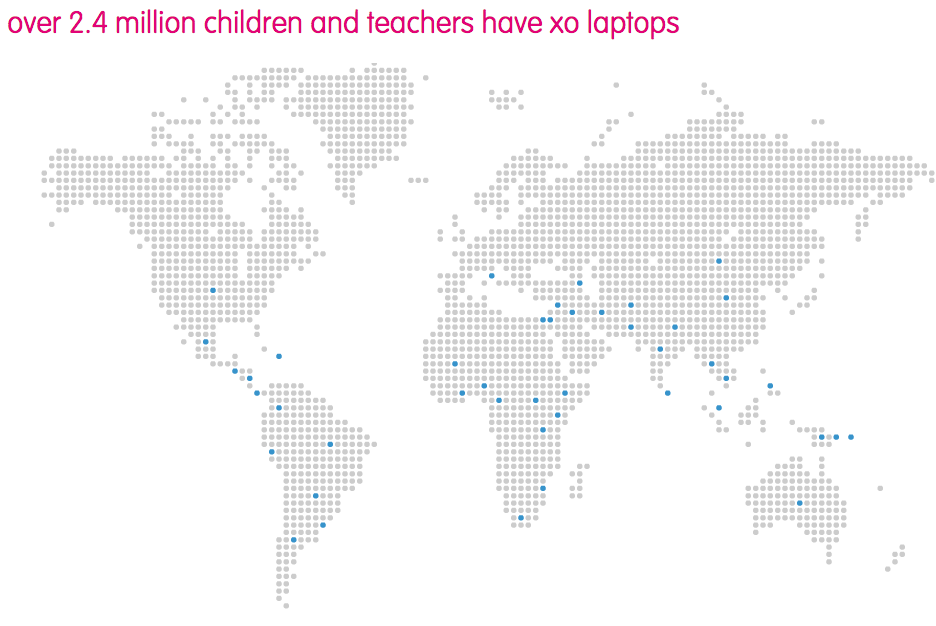

This data is from [http://one.laptop.org/map](http://one.laptop.org/map), extracted on April 1, 2015. This shows how many laptops have been distributed in various countries around the world as part of the One Laptop Per Child project.

This data was originally visualized as the following map:

Data comes as XML from http://one.laptop.org/sites/default/modules/olpc/map_feed/feed.php?r=70

This visualization has several issues:

 * It only shows locations, not quantities.
 * Size could be used to encode quantities, but it is not used at all.
 * Hovering interactions fill the country area with color, and the size of the filled in area has no relation whatsoever to the quantity associated with that area.
 * The only way that the data is expressed is inside a hover interaction, and it is displayed as text.

These shortcomings inspired me to scrape this data and do a visualization redesign.

The data is released under [CC BY 3.0](http://creativecommons.org/licenses/by/3.0/), so feel free to use as long as you include attribution to the OLPC project.

A join was performed with [countries.csv from Google](https://developers.google.com/public-data/docs/canonical/countries_csv) to add lat, lon coordinates. countries.csv was modified to have its names match the olpc data, and Nagorno-Karabakh was added.

Curran K. April 2015
